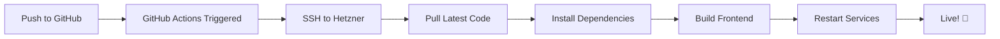

# CI/CD Setup - Auto Deploy on Git Push

This guide sets up automatic deployment to Hetzner whenever you push to the `main` branch.

## ✅ Already Set Up

- GitHub Actions workflow (`.github/workflows/deploy.yml`)
- Deployment scripts on server
- PM2 process management

## 🔐 Required: Add GitHub Secrets

You need to add your server credentials to GitHub:

### Step 1: Get Your SSH Private Key

Run this on your **local machine**:

```bash
cat ~/.ssh/etrack_hetzner_rsa
```

Copy the **entire output** (including `-----BEGIN` and `-----END` lines).

### Step 2: Add Secrets to GitHub

1. Go to your repository: https://github.com/horiaq/shipapp-demo
2. Click **Settings** → **Secrets and variables** → **Actions**
3. Click **"New repository secret"**

Add these two secrets:

#### Secret 1: SERVER_IP
- **Name**: `SERVER_IP`
- **Value**: `91.98.94.41`

#### Secret 2: SSH_PRIVATE_KEY
- **Name**: `SSH_PRIVATE_KEY`
- **Value**: (paste the entire SSH private key from Step 1)

### Step 3: Test Auto-Deployment

Make a small change and push:

```bash
cd "/Users/horiaq/Desktop/Dev Projects/Geniki Taxydromiki"

# Make a test change
echo "# Auto-deploy test" >> README.md

# Commit and push
git add .
git commit -m "Test auto-deployment"
git push origin main
```

### Step 4: Watch Deployment

1. Go to: https://github.com/horiaq/shipapp-demo/actions
2. You'll see your deployment running
3. Takes about 2-3 minutes
4. Check your site: http://91.98.94.41

## 🔄 How It Works



## 📊 Deployment Workflow

When you push to `main`:

1. **GitHub Actions starts**
2. **SSHs into your Hetzner server**
3. **Pulls latest code** from GitHub
4. **Installs dependencies** (backend + frontend)
5. **Builds frontend** (Next.js production build)
6. **Restarts PM2 services** (zero downtime)
7. **Your site is updated!** ✅

## 🎯 Daily Usage

Now you just:

```bash
# Make changes
git add .
git commit -m "Your changes"
git push

# ✨ That's it! Auto-deploys in 2-3 minutes
```

## 📝 View Deployment Logs

### On GitHub:
- Visit: https://github.com/horiaq/shipapp-demo/actions

### On Server:
```bash
ssh root@91.98.94.41
pm2 logs
```

## 🔧 Manual Deployment (if needed)

If auto-deployment fails, you can still deploy manually:

```bash
cd "/Users/horiaq/Desktop/Dev Projects/Geniki Taxydromiki"
./deploy-public.sh
```

Or directly on the server:

```bash
ssh root@91.98.94.41
cd /var/www/shipapp-demo
git pull origin main
npm install --production
cd frontend && npm install && npm run build
pm2 restart all
```

## ⚠️ Important Notes

1. **Never commit** `.env` files with sensitive data
2. **SSH key** is private - keep it secure
3. **Test locally** before pushing to `main`
4. **Check deployment logs** if something fails

## 🚀 Advanced: Deploy to Multiple Environments

You can create branches for different environments:

- `main` → Production (91.98.94.41)
- `staging` → Staging server (if you have one)
- `dev` → Development server

Just modify `.github/workflows/deploy.yml` to handle different branches.

## 📱 Get Deployment Notifications

### Slack Notifications (Optional)

Add this to `.github/workflows/deploy.yml` after the deploy step:

```yaml
- name: Notify Slack
  if: success()
  uses: rtCamp/action-slack-notify@v2
  env:
    SLACK_WEBHOOK: ${{ secrets.SLACK_WEBHOOK }}
    SLACK_MESSAGE: 'Deployment successful! 🎉'
```

### Email Notifications

GitHub automatically sends emails on workflow failures.

## 🛠️ Troubleshooting

### Deployment Fails

1. Check GitHub Actions logs
2. SSH into server and check logs: `pm2 logs`
3. Verify secrets are set correctly
4. Check server disk space: `df -h`

### Services Not Starting

```bash
ssh root@91.98.94.41
pm2 restart all
pm2 logs
```

### Database Issues

```bash
ssh root@91.98.94.41
sudo systemctl status postgresql
```

## 📚 Next Steps

- [ ] Add GitHub secrets (SSH_PRIVATE_KEY, SERVER_IP)
- [ ] Test auto-deployment
- [ ] Set up domain name (optional)
- [ ] Configure SSL with Let's Encrypt
- [ ] Add monitoring (PM2 Plus, New Relic)

---

Need help? Check the deployment logs or contact support!

